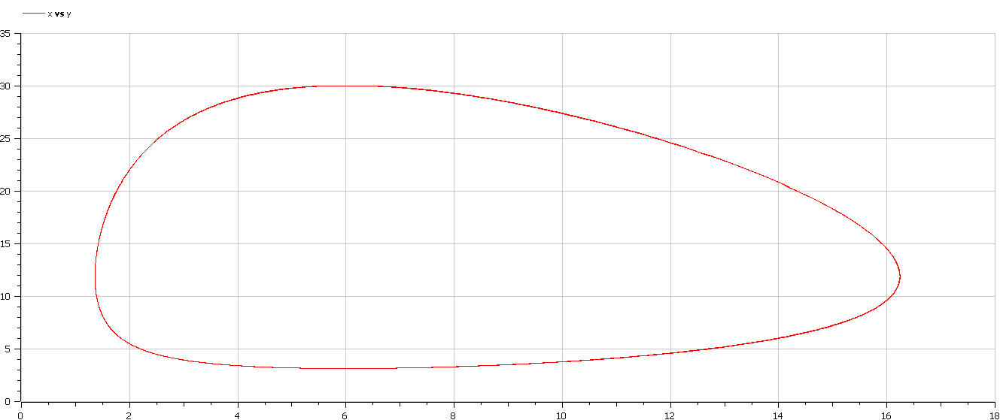
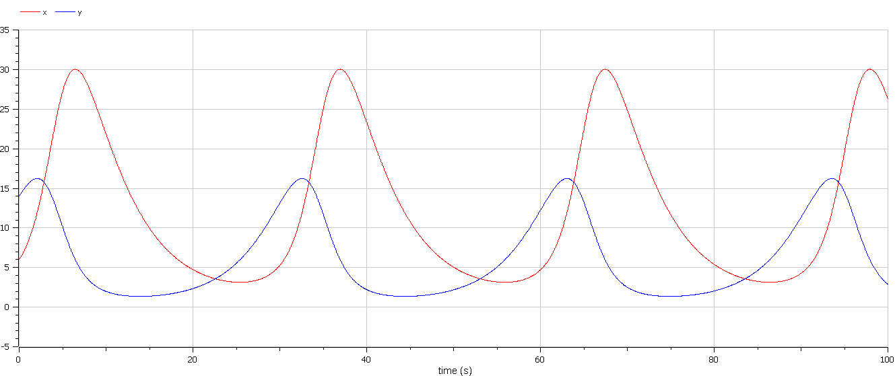

<style>
section::after {
  content: attr(data-marpit-pagination) ' / ' attr(data-marpit-pagination-total);
}
img[alt="center"] {
     display: block;
     margin: 0 auto;
}
h1 {
    font-size: 60px;
    text-align: center;
}
h2 {
    font-size: 30px;
    text-align: left;
    position: relative;
    left: -2em;
    line-height: 0px;
    top: 8em;
}
h3 {
    font-size: 40px;
    text-align: left;
    position: relative;
    left: -0.5em;
    bottom: 0.2em;
}
h4 {
    font-size: 25px;
    text-align: center;
    position: relative;
    left: -0.5em;
    bottom: 0.2em;
}
</style>

# Лабораторная работа №5
## Василий Худицкий 
## РУДН, 2022 Москва, Россия

---

# Прагматика лабораторной работы

- Знакомство с простейшей моделью взаимодействия двух видов типа «хищник – жертва» — моделью Лотки-Вольтерры.

- Визуализация результатов моделирования путем построения фазового портрета и графиков зависимости популяции хищников и жертв от времени.

---

# Цель лабораторной работы

- Научиться строить простейшую модель взаимодействия двух видов типа «хищник – жертва» — модель Лотки-Вольтерры.
- Научиться находить стационарную точку системы.
- Научиться строить фазовый портрет системы для модели Лотки-Вольтерры (зависимость численности популяций хищников и жертв).

---

# Задание лабораторной работы

Для модели «хищник-жертва»:
​	                                                      
$$
\begin{cases} \frac{dx}{dt} = -0.21x(t) + 0.035x(t)y(t) \\ \frac{dy}{dt} = 0.25y(t) - 0.021x(t)y(t)\end{cases}
$$

Построить график зависимости численности хищников от численности жертв, а также графики изменения численности хищников и численности жертв при следующих начальных условиях: $x_0 = 6, y_0 = 14$. Найти стационарное состояние системы.


---

# Результаты выполнения лабораторной работы

---

### Поиск стационарного состояния системы

- $x_0=\frac{c}{d}=\frac{0.25}{0.021}=11.904761904761904761904761904762$
- $y_0=\frac{a}{b}=\frac{0.21}{0.035}=6$


---

# Построение графиков

---
### Моделирование

```Modelica
 model lab05
  constant Real a=0.21;//коэффициент смертности хищников
  constant Real b=0.035;//коэффициент прироста популяции хищников
  constant Real c=0.25;//коэффициент прироста популяции жертв
  constant Real d=0.021;//коэффициент смертности жертв
  Real x;//количество хищников
  Real y;//количество жертв

initial equation
  x=6;//начальное количество хищников
  y=14;//начальное количество жертв
  
equation//система уравнений
  der(x)=-a*x+b*x*y;
  der(y)=c*y-d*x*y;
end lab05;
```

---

#### 
##### Рис.1 График зависимости изменения численности хищников от изменения численности жертв

---

#### 
##### Рис.2 График колебаний изменения числа популяции хищников и популяции жертв

---

# Выводы

В результате выполнения лабораторной работы научился:
- строить простейшую модель взаимодействия двух видов типа «хищник – жертва» — модель Лотки-Вольтерры
- находить стационарную точку системы
- строить фазовый портрет системы для модели Лотки-Вольтерры (зависимость численности популяций хищников и жертв).
